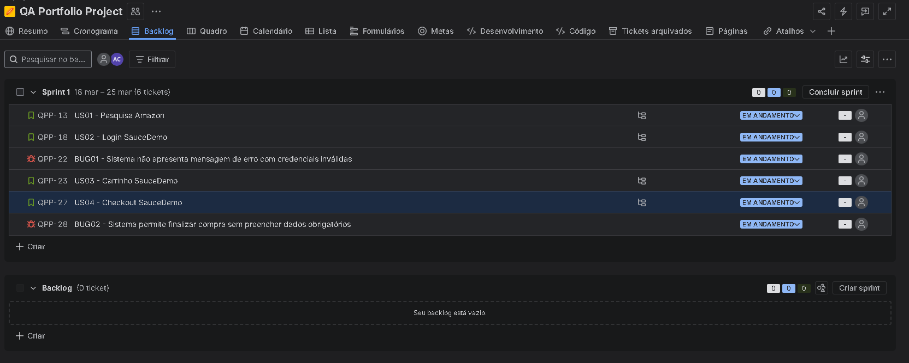
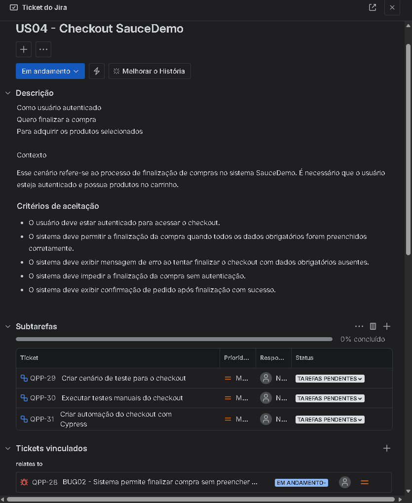
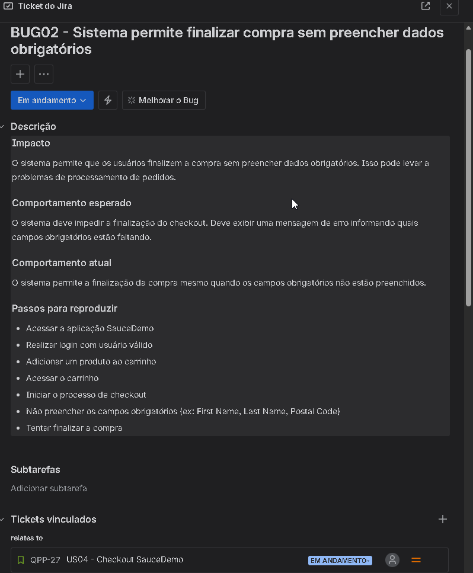
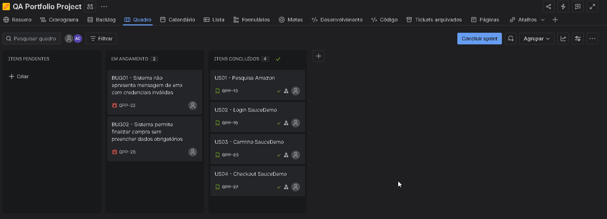
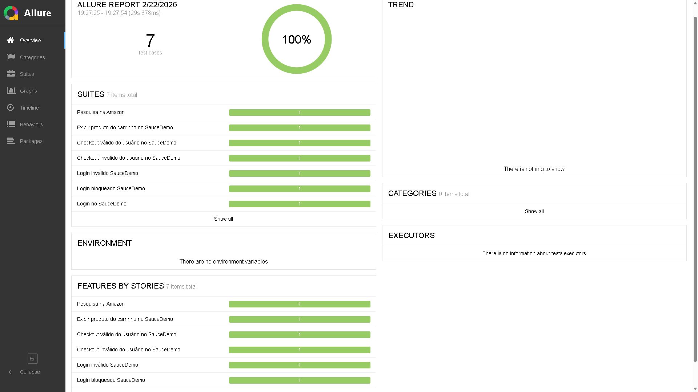

# 🧪 Projeto de Automação de Testes | QA Portfolio

Este repositório contém meus estudos e práticas em **Automação de Testes Web e API**, com foco em qualidade de software, organização de projeto e boas práticas utilizadas no mercado de QA.

O objetivo do projeto é consolidar conhecimentos em:

- Testes Funcionais
- Testes Regressivos
- BDD (Behavior Driven Development)
- Automação Web
- Testes de API
- Gestão de tarefas e bugs com Jira

Este projeto representa minha evolução prática na área de **Quality Assurance**.

---

# 🚀 Tecnologias Utilizadas

### Automação Web
- Cypress
- Cucumber (BDD) – `@badeball/cypress-cucumber-preprocessor`
- Page Object Model (POM)
- Custom Commands
- JavaScript

### Testes de API
- Postman
- Test Scripts (JavaScript)

### Relatórios
- Allure Reports

### Ferramentas
- Git
- GitHub
- Jira 

---

# 🧠 Conceitos Aplicados

✔ Testes Funcionais  
✔ Testes Negativos  
✔ Fluxos End-to-End (E2E)  
✔ Testes de API REST  
✔ Estrutura baseada em Page Object  
✔ Organização por Features (BDD)  
✔ Validação de respostas JSON  
✔ Versionamento com Git Flow
✔ Criação de User Stories
✔ Criação de Bugs
✔ Quebra de tarefas (Subtasks)
✔ Gestão de Sprint e Backlog

---

# 📂 Estrutura do Projeto

cypress/
┣ e2e/
┃ ┗ features/
┃ ┣ SauceDemo/
┃ ┗ Amazon/

support/
┣ pages/
┣ step_definitions/
┣ commands/

postman/
┣ collections/
┃ ┣ books-api-tests.json
┃ ┣ fakestore-api-tests.json
┃ ┗ reqres-api-tests.json.json

jira/
┣ bugs/
┣ evidencias/
┣ user-stories/

---

# 🧪 Gestão de Testes com Jira

Neste projeto, utilizei o Jira para simular o fluxo real de trabalho de um QA em ambiente ágil.

---

## 📌 Atividades realizadas

- Criação de User Stories baseadas nos cenários BDD  
- Definição de critérios de aceitação  
- Quebra de tarefas em Subtasks  
- Criação e documentação de Bugs  
- Organização de Sprint  
- Gestão de Backlog  

---

## 🔄 Fluxo aplicado

User Story → Subtasks → Execução de testes → Automação → Bug Report  

---

## 📸 Evidências do Jira

### 📋 Backlog e Sprint

  

---

### 🧾 User Story (Checkout)

  

---

### 🧩 Subtasks (quebra de tarefas)

  

---

### 🐞 Bug Report

  

---

### 📊 Board da Sprint

  

---

# 📸 Evidências de Execução

## ✅ Execução dos Testes Web (Cypress)

  

Execução da suíte de testes automatizados utilizando Cypress em modo headless, validando os fluxos implementados nas aplicações SauceDemo e Amazon.

---

## 📊 Relatório Allure

  

Relatório gerado com Allure apresentando visão consolidada da execução dos testes, incluindo status dos cenários, tempo de execução e evidências da automação.

---

## 📁 Estrutura do Projeto

  

Organização do projeto seguindo boas práticas de automação, separando features, step definitions, pages e comandos reutilizáveis.

---

## 🧪 Cenários BDD

<table>
<tr>
<td align="center">

**SauceDemo**

</td>
<td align="center">

**Amazon**

</td>
</tr>
</table>

Cenários escritos em **Gherkin** utilizando Cucumber, representando regras de negócio e fluxos de usuário nas aplicações testadas.

---

## 🔧 Step Definitions

<table>
<tr>
<td align="center">

**SauceDemo**

</td>
<td align="center">

**Amazon**

</td>
</tr>
</table>

Implementação dos passos descritos nos cenários BDD, conectando os steps escritos em Gherkin com a lógica de automação desenvolvida em JavaScript.

---

## 🧩 Arquitetura de Automação

<table>
<tr>
<td align="center">

**Custom Command (SauceDemo)**

</td>
<td align="center">

**Page Object Model (Amazon)**

</td>
</tr>
</table>

Aplicação de diferentes estratégias de organização da automação:

- **Custom Commands** utilizados no projeto SauceDemo para reutilização de comandos comuns e simplificação dos testes  
- **Page Object Model** aplicado no projeto Amazon para centralização de seletores e interações da página

---

# 🧪 Automação Web

## Cenários Automatizados

### 🛒 SauceDemo

- Login válido
- Login inválido
- Usuário bloqueado
- Adição de produto ao carrinho
- Checkout com sucesso
- Validação de campos obrigatórios

### 🔍 Amazon

- Pesquisa de produto
- Validação de resultados
- Validação de comportamento da busca

---

# 🌐 Testes de API

Os testes de API foram desenvolvidos utilizando **Postman** para validar endpoints REST e garantir a integridade das respostas da aplicação.

Foram utilizadas APIs públicas para simular cenários reais de testes.

---

## APIs utilizadas

### ReqRes API
Utilizada para simular operações de usuários e praticar testes de endpoints REST como:

- Listagem de usuários
- Criação de usuário
- Atualização de usuário
- Exclusão de usuário

### Books API
Utilizada para validar endpoints de consulta de livros, permitindo testar:

- Estrutura de resposta JSON
- Campos obrigatórios
- Listagem de dados

### FakeStore API
API pública de e-commerce utilizada para validar:

- Listagem de produtos
- Estrutura de resposta da API
- Tipos de dados retornados

---

## 🧪 Validações aplicadas nos testes de API

✔ Status Code das respostas HTTP  
✔ Estrutura do JSON retornado pela API  
✔ Presença de campos obrigatórios  
✔ Tipos de dados corretos nas propriedades  
✔ Tempo de resposta da API

---

# 📸 Evidências de Testes de API

### Execução da Collection no Postman

  

---

### Exemplo de Request com Testes Automatizados

  

---

### Estrutura da Collection

  

---

🔁 Estratégia de Testes

Os testes foram estruturados para:

Validar regras de negócio

Cobrir cenários positivos e negativos

Servir como base para regressão

Garantir robustez evitando validações frágeis

---

## 📊 Relatórios (Allure)

### Gerar relatório

npx allure generate allure-results --clean

### Abrir relatório

npx allure open

---

# ▶️ Como Executar o Projeto

### Clonar repositório

git clone <url-do-repositorio>

### Instalar dependências

npm install

---

## Executar testes Web

### Modo interativo

npx cypress open

### Modo headless

npx cypress run

---

# 🔄 Versionamento

Fluxo adotado:

- Desenvolvimento na branch `testes`
- Validação local
- Pull Request para `main`
- Branch `main` sempre estável

---

# 📈 Próximos Passos

- Integração dos testes de API com Newman
- Integração com CI/CD
- Ampliação da suíte de regressão
- Inclusão de cenários derivados de testes exploratórios

---

# 👨‍💻 Sobre

Sou um **QA em evolução**, focado em construir uma base sólida em:

- Qualidade de Software
- Automação de Testes
- Boas práticas de mercado

Este repositório representa minha jornada prática de aprendizado e aprimoramento contínuo.